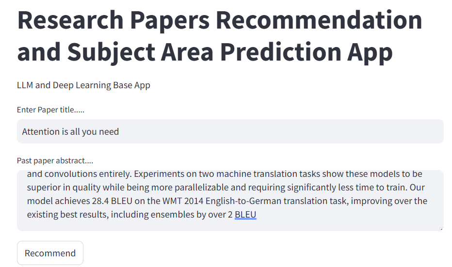
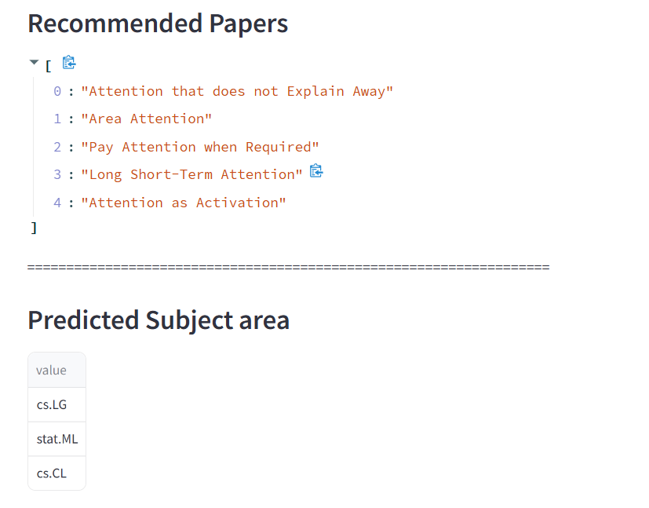

# SmartScholar
Deep Learning for Research Paper Insights

## Overview
This repository contains a machine learning project featuring two main functionalities: a research papers recommendation system and subject area prediction. The project's objective is to offer users personalized recommendations based on their preferences and to accurately predict the subject area of research papers.

# Features

## Research Papers Recommendation System
- **Sentence Transformers:** Utilizes sentence embeddings with cosine similarity to recommend research papers based on user preferences and similarities to other vectors.
- **Deep Learning Model:** Implements a multi-layer perceptron (MLP) to capture complex patterns and enhance the recommendation accuracy.

## Subject Area Prediction
- **Text Classification:** Employs natural language processing techniques to classify research papers into their respective subject areas accurately.

# How to Use

1. **Dataset Preparation:**
   - Prepare your dataset with research paper titles, abstracts, and corresponding subject areas.
   - Custom dataset are allowed.

2. **Training Models:**
   - Use the provided sources to train models for subject area prediction and recommendation generation.
   - main.py file consist of all the necessary scripts to prepare the dataset, train and evaluate the model.

# Installation

- Clone the repository
```bash
git clone https://github.com/yash-raj202134/SmartScholar.git
```
- Install the required dependencies
```bash
pip install -r requirements.txt
```
- Download all the resources
```bash
python main.py
```
- Run the app
```bash
streamlit run app.py
```
# App 


# Results

- **Research Papers Recommendation:**
  - The system recommends the top K research papers based on user input.
  - The integration of the deep learning model significantly improved the recommendation accuracy, achieving 99%.

- **Subject Area Prediction:**
  - The text classification model effectively predicts the subject area of research papers, enhancing user experience and search relevance.

# License

This project is licensed under GNU 

[License](LICENSE)

# Acknowledgments

Special thanks to the developers and contributors of third-party tools, libraries, and resources used in this project, including TensorFlow, PyTorch, Hugging Face Transformers, and various NLP libraries. Their contributions were invaluable in the development of this project.
